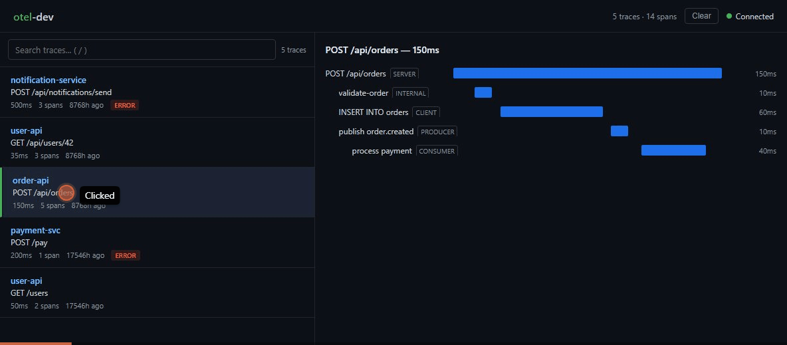

# otel-dev

**See your OpenTelemetry traces locally with one command.**

[](https://www.npmjs.com/package/otel-dev)
[](./LICENSE)
[](https://nodejs.org)

No Jaeger. No Docker. No config.
Just `npx otel-dev` and start seeing traces.

<p align="center">
  
</p>

---

## Quick start

```bash
# Terminal 1: Start otel-dev
npx otel-dev

# Terminal 2: Run your app with OTel
npx otel-dev init              # generates instrument.ts
npm install @opentelemetry/sdk-node @opentelemetry/exporter-trace-otlp-http @opentelemetry/auto-instrumentations-node @opentelemetry/resources @opentelemetry/semantic-conventions
node --import ./instrument.ts your-app.ts
```

That's it. Traces show up in real-time.

## Modes

**TUI** (default) -- `npx otel-dev`
Terminal trace viewer with keyboard navigation.

**Web UI** -- `npx otel-dev --web`
Opens a browser-based viewer at `localhost:4318`.

**Init** -- `npx otel-dev init`
Generates OpenTelemetry setup files for your project.

## Features

- OTLP/JSON receiver on `:4318`
- TUI with trace list and span waterfall tree
- Web UI with live updates via SSE
- In-memory storage (last 1000 spans)
- Zero config, zero dependencies beyond npm
- Works with any OTel-instrumented app (Node.js, Go, Python, etc.)

## CLI reference

```
npx otel-dev              Start TUI trace viewer
npx otel-dev --web        Start Web UI
npx otel-dev init         Generate OTel setup
npx otel-dev --port 9999  Custom port
npx otel-dev --help       Show help
```

## How it works

Starts an HTTP server that accepts OTLP/JSON on `/v1/traces`. Your OTel-instrumented app sends traces to it. otel-dev renders them in real-time -- as a terminal TUI or a web interface.

## Comparison

|  | otel-dev | Jaeger | otel-tui | otel-desktop-viewer |
|---|---|---|---|---|
| Install | `npx` | Docker | Binary (Go) | Binary (Go) |
| Language | Node.js | Go/Java | Go | Go |
| TUI | yes | no | yes | no |
| Web UI | yes | yes | no | yes |

## Related

otel-dev was born from the observability chapters of [The Whole and the Part](https://github.com/Felipeness/the-whole-and-the-part), an open-source book on holonomic software architecture.

## License

[MIT](./LICENSE)
